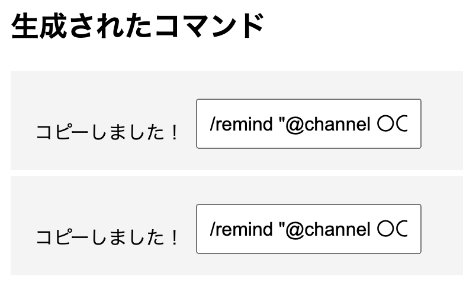

# slackリマインダーコマンド生成アプリ

このアプリケーションは以下のURLからアクセスできます．

https://blooming-falls-71077-b4f7ce20c543.herokuapp.com/

## 使い方
1. メッセージを入力    
    - slackのリマインダーに送りたいメッセージを書きます．（00の締切など）
2. 締切を入力
    - その締切の日時を入力，時刻も入力します．
3. いつリマインドするかを生成
    - そのリマインダーをいつリマインドさせたいのかを選択します．
4. 生成&コピー
    - 生成ボタンを作るとコマンドが作成されるのでコピーボタンを押してSlackへ投稿します．

## 実際の動作例
順序に従って入力すると以下のように複数のコマンドが生成されます．

## 備考
- 環境：Python(Flusk)，Html，CSS
- デプロイ:Heroku
- プルリク歓迎です